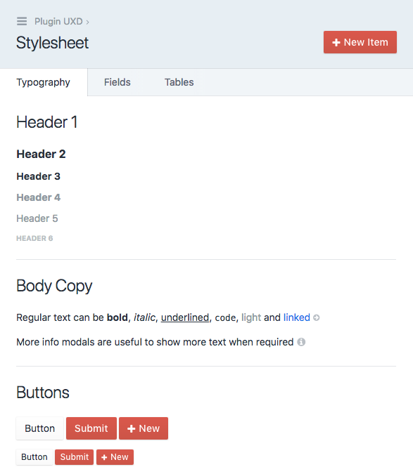
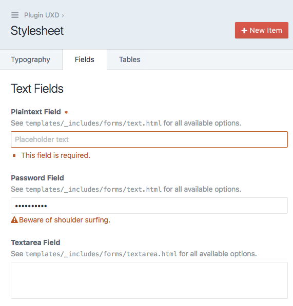
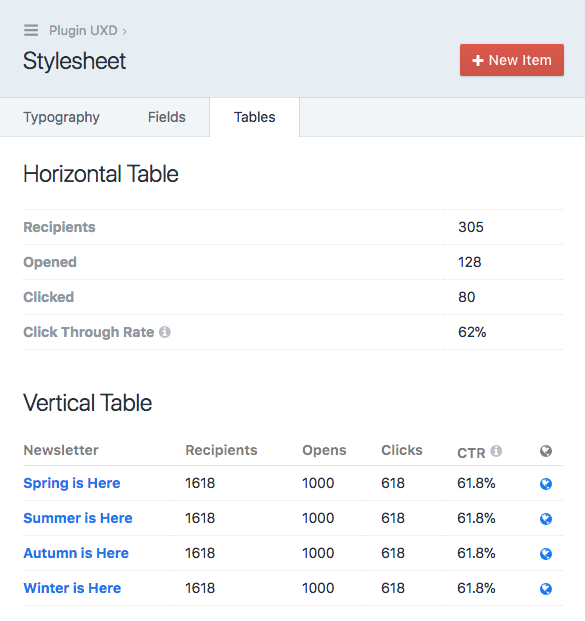
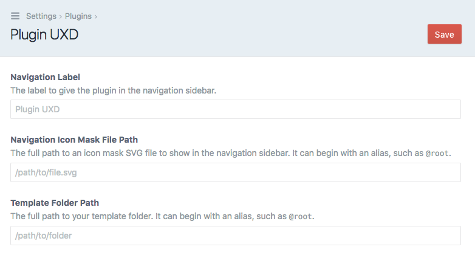

# Plugin UXD for Craft CMS 3

The Plugin UXD plugin is a user experience designer for plugin control panel pages in [Craft CMS](https://craftcms.com/).

It provides a set of typography, field and table elements that enables you to quickly design and develop your plugin control panel pages. 

## Requirements

Craft CMS 3.0.0 or later.

## Installation

To install the plugin, search for "Plugin UXD" in the Craft Plugin Store, or install manually using composer.

        composer require putyourlightson/craft-plugin-uxd

## Settings

**Navigation Label**  
The label to give the plugin in the navigation sidebar.

**Navigation Icon Mask File Path**  
The full path to an icon mask SVG file to show in the navigation sidebar. It can begin with an alias, such as `@root`.

**Template Folder Path**  
The full path to your template folder. It can begin with an alias, such as `@root`.

Any references to your templates (included or extended) should be written as plugin-uxd/temp/{template-path}, for example:

    

The stylesheet is always available at /admin/plugin-uxd/stylesheet

<small>Created by [PutYourLightsOn](https://www.putyourlightson.net/).</small>
